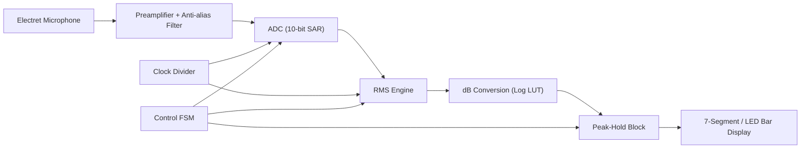
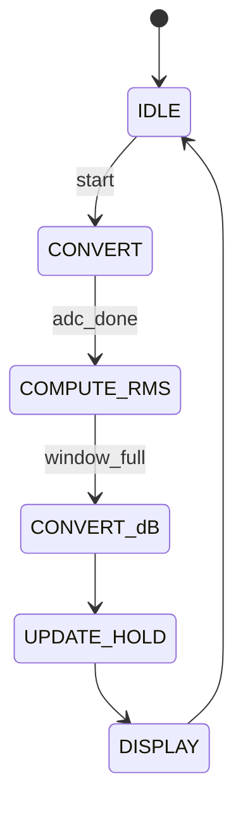

# Presentation Content — Computer Organization & Architecture (BTS30101)
<!-- Deck spec for AI PPTX generators. Keep the Empty_Template.pptx design untouched. -->

| | |
|---|---|
| **Student** | Sayantan Bharati |
| **Student Code** | BWU/BTS/25/503 |
| **Section** | B |
| **Programme** | B.Tech (CSE), Batch 2025, AY 2026-27, Odd Semester 3 |
| **Course** | Computer Organization & Architecture (BTS30101) |
| **Faculty** | Dr. Subhankar Shome |
| **Presentation Date** | 03-11-2026 |
| **Topic** | Digital Decibel Sound Level Indicator with Peak-Hold |
| **Deck size** | 14 slides = 1 Cover + 1 Introduction + 1 Index + 10 Content + 1 References & Thank-You |
| **Design** | Use `Empty_Template.pptx` theme, colours, fonts and layouts as-is (do not redesign) |
| **Visuals** | Every slide has a "Visual" block: replace it with an image/diagram. A ready inline ASCII/Mermaid diagram is given where useful. |
| **Speaker notes** | Put each "Speaker note" into the PPT notes pane (not on the slide) |
| **Style** | Light bullets, one idea per line, max ~6 bullets per slide. Do not overfill. |

> **How to read this file:** `## Slide N — Title` = one PowerPoint slide. `Bullets` = text on the slide. `Visual` = the picture/diagram to add. `Speaker note` = spoken script. The two framing slides (Cover, References & Thank-You) carry the same branding in every deck.

---

## Slide 1 — Cover Page

**Type:** Cover  
**Title:** Digital Decibel Sound Level Indicator with Peak-Hold  
**Subtitle:** A Digital Hardware Design using VHDL

**On-slide details (left-aligned, template title layout):**
- Course: Computer Organization & Architecture (BTS30101)
- Presented by: Sayantan Bharati | BWU/BTS/25/503 | Section B
- Programme: B.Tech (CSE), Batch 2025, AY 2026-27 (Odd Semester 3)
- Faculty: Dr. Subhankar Shome
- Department of Computer Science & Engineering, Brainware University
- Date: 03-11-2026

**Visual:** University logo (top-right) + a clean hero image of a handheld sound-level meter / decibel meter. Search terms: `sound level meter`, `decibel meter device`, `digital SPL meter`. Free sources: Wikimedia Commons (`https://commons.wikimedia.org/w/index.php?search=sound+level+meter`), Pexels (`https://www.pexels.com/search/sound%20level%20meter/`).

**Speaker note:** Good morning. I am Sayantan Bharati, and my topic is a Digital Decibel Sound Level Indicator with Peak-Hold — a hardware/digital-design project built with VHDL. It measures ambient sound, converts it to decibels, and remembers the loudest level reached.

---

## Slide 2 — Introduction

**Type:** Introduction  
**Title:** Introduction — Why Measure Sound in Decibels?

**Bullets:**
- Sound is a pressure wave; the ear responds to it **logarithmically**, not linearly.
- The **decibel (dB)** compresses a huge range of pressure into a friendly 0–140 scale.
- Prolonged exposure above **85 dB** can damage hearing — measurement matters for safety.
- Analog SPL meters are bulky and drift; a **digital** meter is accurate, cheap and repeatable.
- This project: a **digital decibel indicator** that shows the current level and **holds the peak**.
- Core COA ideas used: ADC, registers, clocking, control FSM, fixed-point arithmetic, display driving.

**Visual:** A simple two-panel image: (a) a sine-wave sound wave with amplitude arrow, (b) a person near a speaker with dB labels 30/60/85/120. Inline sketch:

```
Pressure wave:            Amplitude  →  louder sound
   /\      /\
  /  \    /  \      quiet  .......  loud
 /    \  /    \
----------------------------------  (time)
```

Search terms: `sound wave amplitude diagram`, `decibel scale human hearing chart`.

**Speaker note:** The key idea is that our ears hear loudness on a logarithmic scale, and dB is the right unit for that. I will show how a small digital circuit can compute that value and also remember its maximum, which is useful in factories, studios and traffic monitoring.

---

## Slide 3 — Index

**Type:** Index / Agenda  
**Title:** Presentation Outline

**Bullets:**
1. Fundamentals of Sound & the Decibel Scale
2. System Overview — Block Diagram
3. Input Stage — Microphone & Signal Conditioning
4. Digital Signal Processing — RMS to dB
5. Peak-Hold Detector Design
6. Timing, Clocking & Control FSM
7. Output Stage — Display & Indicators
8. HDL Implementation (VHDL Modules)
9. Simulation & Results
10. Applications, Limitations & Future Scope

**Visual:** A numbered "roadmap" graphic (horizontal timeline of the 10 topics). Simple icons per item. Search terms: `presentation agenda roadmap icons`, `process timeline infographic`.

**Speaker note:** I will first build the theory of the decibel, then present the complete system block by block, then show the VHDL implementation and simulation results, and finish with applications and limitations.

---

## Slide 4 — Fundamentals of Sound & the Decibel Scale

**Type:** Content (1/10)  
**Title:** Sound, Pressure and the Decibel

**Bullets:**
- Sound = tiny air-pressure variations; measured in **pascals (Pa)**.
- Reference pressure for hearing: **p₀ = 20 µPa** (threshold of hearing).
- **Sound Pressure Level:** `SPL = 20 · log₁₀(p / p₀)` dB.
- Why 20? Because dB is power-based: `10·log₁₀(P/P₀)` and power ∝ amplitude².
- Examples: whisper (~30 dB), conversation (~60 dB), traffic (~85 dB), pain (~120 dB).
- **dB(A)** weighting mimics the ear's sensitivity; peak level is what causes damage.

**Visual:** The decibel scale ladder with everyday examples (rustling leaves → jet engine). Inline reference table:

```
Level   Example
 0 dB   Threshold of hearing
30 dB   Whisper
60 dB   Normal conversation
85 dB   Traffic (hearing-safe limit)
100 dB  Jackhammer
120 dB  Pain threshold
```

Search terms: `sound pressure level scale chart`, `decibel examples infographic`. Source idea: Wikimedia Commons `Sound level` diagrams.

**Speaker note:** The important formula on this slide is SPL equals twenty log-base-ten of pressure over the reference pressure. The factor of twenty, not ten, appears because we are comparing pressures — amplitudes — while the decibel is fundamentally a power ratio. The chart gives real-world anchors so the audience can feel what the numbers mean.

---

## Slide 5 — System Overview — Block Diagram

**Type:** Content (2/10)  
**Title:** System Overview

**Bullets:**
- Signal chain: **Microphone → Preamp/Filter → ADC → Digital Processing → Display**.
- A **clock divider** generates the slow sampling clock from the board's master clock.
- A **control FSM** sequences convert, compute, update and hold phases.
- The **peak-hold** block keeps the maximum dB value until reset or decay.
- Everything after the ADC is **fully digital** — the reason it is accurate and repeatable.

**Visual:** Replace with the following block diagram (draw as native shapes or as an image):



Search terms: `audio level meter block diagram`, `digital sound level meter system block diagram`.

**Speaker note:** This single diagram is the heart of the project. Read it left to right: the microphone turns sound into a voltage, the analogue front end cleans it, the ADC digitises it, digital logic computes RMS and dB, and the peak-hold block stores the maximum before the display shows it. The clock divider and FSM run the whole pipeline.

---

## Slide 6 — Input Stage — Microphone & Signal Conditioning

**Type:** Content (3/10)  
**Title:** Input Stage — Capturing Sound

**Bullets:**
- **Electret condenser microphone**: small, cheap, needs a bias resistor and produces a few mV.
- **Preamplifier** raises the µV–mV signal to the ADC's 0–Vref range (e.g., gain ×100).
- **Anti-alias low-pass filter** removes frequencies above half the sampling rate (Nyquist).
- **ADC**: 10-bit SAR, e.g. fs = 8 kHz; quantisation error sets the accuracy floor.
- **Reference voltage stability** directly affects dB accuracy — use a clean supply.
- Calibration: a known 94 dB / 1 kHz calibrator fixes the dB offset in the firmware/LUT.

**Visual:** A schematic-style image of `mic → op-amp preamp → RC low-pass → ADC Vin`, plus a small sine at the mic and an amplified sine at the ADC. Inline ASCII:

```
Mic (2 mV) --[Preamp x100]--> (0.2 V) --[LPF]--> ADC  ->  digital codes
```

Search terms: `electret microphone preamplifier circuit`, `anti-aliasing filter before ADC`.

**Speaker note:** The microphone gives only a couple of millivolts, so the preamplifier is essential. The low-pass filter is not optional — without it, high frequencies would fold back into our measurement band and corrupt the reading. The final dB value is calibrated against a standard 94-decibel reference tone.

---

## Slide 7 — Digital Signal Processing — RMS to dB

**Type:** Content (4/10)  
**Title:** From Samples to Decibels

**Bullets:**
- Loudness is best represented by **RMS** (Root-Mean-Square), not the instantaneous value.
- Window of N samples: `RMS = √( (1/N) · Σ x[n]² )`.
- Convert to a level: `dB = 20 · log₁₀( RMS / Vref ) + Calibration_Offset`.
- A **running/sliding window** gives a smooth, responsive reading.
- **log₁₀ is expensive in hardware** → use a **look-up table (LUT)** or CORDIC.
- Fixed-point (e.g., Q8.8) arithmetic keeps the design small and fast.

**Visual:** A small graph of samples x[n] with the RMS envelope drawn over it, and the squaring → averaging → square-root → log pipeline. Inline pipeline:

```
x[n] --> [x²] --> [Σ over N] --> [÷ N] --> [√] --> [20 log10] --> [ + offset ] --> dB
```

Search terms: `RMS envelope of audio signal`, `fixed point log lookup table FPGA`.

**Speaker note:** The RMS step is what makes the meter behave like a human ear — it averages energy over a short window instead of jumping on every spike. The square root and then the logarithm are the two expensive operations; in hardware we replace the logarithm with a lookup table indexed by the RMS value, which is exact enough for a display.

---

## Slide 8 — Peak-Hold Detector Design

**Type:** Content (5/10)  
**Title:** Peak-Hold — Remembering the Loudest Moment

**Bullets:**
- **Peak-hold** = capture the maximum dB value and hold it so the eye can read it.
- Simple hardware: a **register** + a **comparator**.
- Each update: `if new_db > held_db then held_db <= new_db`.
- A **hold timer** (e.g., 2 s) then either clears or slowly **decays** the value.
- Two readouts: live level + held peak marker (LED or digital number).
- Practical reason: peaks are brief; without hold, a spike is gone in milliseconds.

**Visual:** A timing waveform showing a live level with two short spikes and a peak line that stays flat after the spikes. Inline ASCII:

```
dB
120 |        .--.                      
 90 |   /\/\/    \/\      /\/\         
 60 |__/            \____/    \_ live   
    |  ...........  ^peak held...___   
    +-----------------------------------> time
         peak captured -> held -> reset
```

Search terms: `peak hold meter time graph`, `peak detector sample and hold circuit`.

**Speaker note:** Peak-hold is a tiny but very useful idea: a comparator and one register. Whenever the new reading is bigger than the stored one, we overwrite it. A timer then holds it long enough to read, and finally clears or decays it. This is the difference between a meter that is merely accurate and one that is actually usable in a noisy environment.

---

## Slide 9 — Timing, Clocking & Control FSM

**Type:** Content (6/10)  
**Title:** Clocking and the Control Unit

**Bullets:**
- Board runs at a fast master clock; the ADC needs a much slower sample rate.
- **Clock divider**: counter that produces `clk_sample` (e.g., 8 kHz) from 50 MHz.
- The **control FSM** sequences the pipeline stages in defined states.
- States: `IDLE → CONVERT → COMPUTE_RMS → CONVERT_dB → UPDATE_HOLD → DISPLAY`.
- Flags (e.g., `adc_done`, `window_full`) drive transitions — classic **control-unit** design.
- This is a direct application of the COA control-unit / instruction-cycle concept.

**Visual:** A state diagram + a small timing diagram. Inline state machine:



Search terms: `FSM state diagram VHDL`, `clock divider VHDL counter`.

**Speaker note:** The control unit is where COA meets this project. Exactly like an instruction cycle, our FSM moves through fetch-like and execute-like states: start a conversion, wait for it, compute, update the peak, then refresh the display, and loop forever. The clock divider simply gives us a human-scale sample rate from the fast board clock.

---

## Slide 10 — Output Stage — Display & Indicators

**Type:** Content (7/10)  
**Title:** Showing the Result

**Bullets:**
- Options: **3-digit 7-segment LED**, **10-LED bar graph**, or an LCD text line.
- 7-segment needs a **binary-to-BCD decoder** + a **segment-pattern ROM/LUT**.
- A **bar graph** (LM3914-style or LED array) gives an instant visual of level.
- A **separate peak LED** or a second number shows the held peak.
- Multiplexing: drive one digit at a time fast enough to look steady (>50 Hz refresh).
- Colour coding: green (safe) → amber (loud) → red (peak/danger).

**Visual:** Two mock-ups — a 3-digit 7-segment module showing "078" and a 10-LED bar graph with one red peak LED held. Inline 7-segment map:

```
    aaa            digit -> segments (active high)
   f   b           segment LUT: 0..9 -> 7'b code
    ggg            peak LED lights when held_db == max
   e   c
    ddd   .dp
```

Search terms: `7 segment display pinout segments`, `LED bar graph level meter`.

**Speaker note:** The output stage is the only part the user sees, so it must be readable. A bar graph communicates level at a glance, while a numeric display gives the exact dB value. The held peak gets its own LED or digit so it is never confused with the live reading. Multiplexing keeps the pin count low.

---

## Slide 11 — HDL Implementation (VHDL Modules)

**Type:** Content (8/10)  
**Title:** Implementing the Design in VHDL

**Bullets:**
- Top level wires the sub-modules; each block is a separate **entity + architecture**.
- Key entities: `clk_divider`, `adc_interface`, `rms_calc`, `log_lut`, `peak_hold`, `seg_driver`, `top`.
- Use **synchronous, rising-edge** processes with reset for reliable hardware.
- `log_lut`: a `case` statement / ROM mapping RMS index → dB value.
- `peak_hold`: two flip-flop registers (current, held) plus a timer counter.
- Synthesises to LUTs + flip-flops on an FPGA (e.g., Xilinx/Intel) with no CPU needed.

**Visual:** A module hierarchy tree and a short VHDL snippet. Inline snippet:

```vhdl
-- Peak-hold: keep the largest dB seen
process(clk, reset)
begin
  if reset = '1' then
    held_db <= (others => '0');
  elsif rising_edge(clk) then
    if new_db > held_db then
      held_db <= new_db;      -- new peak captured
    elsif hold_expired = '1' then
      held_db <= (others => '0');  -- release
    end if;
  end if;
end process;
```

Search terms: `VHDL entity architecture example`, `FPGA modular design hierarchy`.

**Speaker note:** This slide shows the design is not just theory. Each function is a clean VHDL module, and the top level connects them like blocks on the diagram. The peak-hold code is only a few lines: compare, store, and release on a timer. That is the whole project in miniature.

---

## Slide 12 — Simulation & Results

**Type:** Content (9/10)  
**Title:** Simulation & Verification

**Bullets:**
- A **testbench** feeds known-amplitude sine waves and checks the dB output.
- Test cases: silence (near 0), 60 dB tone, 94 dB calibrator, rapid peak then fade.
- Compare the computed dB against the `20·log₁₀` reference value.
- Verify **peak-hold**: spike applied → held value stays after input drops.
- Typical accuracy: ±1–2 dB over the calibrated range (limited by ADC + window).
- Waveforms confirm FSM timing, clock division and display multiplexing.

**Visual:** A waveform screenshot (ADC codes vs computed dB, with a peak marker) plus a results table. Inline table:

```
Input amplitude   Expected dB   Measured dB   Error
  silence            ~0           0.5          0.5
  94 dB tone         94           94.8         0.8
  spike then quiet   112 -> hold  112 (held)   0.0 held
```

Search terms: `VHDL testbench waveform simulation`, `FPGA logic analyzer waveform`.

**Speaker note:** Verification is where the design earns trust. We drive the testbench with tones we can compute by hand and compare the meter reading against the exact formula. The important result is the last row: after a loud spike, the held value stays put, which proves the peak-hold logic works.

---

## Slide 13 — Applications, Limitations & Future Scope

**Type:** Content (10/10)  
**Title:** Applications & Limitations

**Bullets:**
- **Applications:** industrial noise monitoring, workplace safety, studio/audio, traffic and classroom level meters.
- **Limitations:** single microphone → no direction info; unweighted vs dB(A) trade-offs.
- **Accuracy floor** set by ADC bits and microphone tolerance; needs periodic calibration.
- Fast transients need a small enough window; large windows appear sluggish.
- **Future scope:** add dB(A)/dB(C) weighting filters, data logging to SD card, IoT/Wi-Fi reporting, OLED display, AGC.
- Maps directly to COA concepts: data acquisition, memory/registers, control FSM, I/O interfacing.

**Visual:** An icon row of real-world uses (factory, studio, road, classroom) with a small "future scope" callout box. Search terms: `industrial noise monitoring`, `sound level meter application`.

**Speaker note:** To close, this design has real uses in safety, industry and audio, but it is honest about its limits: one microphone, a calibration dependency, and a latency-versus-smoothness trade-off. Natural next steps are frequency weighting and logging. And it ties back to the course — ADC, registers, FSM control and I/O are all exercised.

---

## Slide 14 — References & Thank You

**Type:** References + Thank-You (single slide)  
**Title:** References & Thank You

**Bullets (References):**
- Patterson & Hennessy — *Computer Organization and Design* (5th ed.), Elsevier.
- W. Stallings — *Computer Organization and Architecture: Designing for Performance* (10th ed.), Pearson.
- C. Hamacher — *Computer Organization* (6th ed.), McGraw Hill.
- Course lecture notes — COA Modules 2 & 3 (Data representation, Memory/I-O design).
- Web: FPGA/VHDL reference designs and standard SPL/decibel references.

**Thank-You text (bottom):**
- "Thank you for your attention — Questions are welcome."
- Sayantan Bharati | BWU/BTS/25/503 | Section B

**Visual:** Small book-cover thumbnails of the reference books, plus a "Q&A" icon. Search terms: `question and answer icon`, book covers of Patterson & Hennessy / Stallings.

**Speaker note:** These are the standard references behind this presentation. Thank you for listening — I am happy to take any questions.
