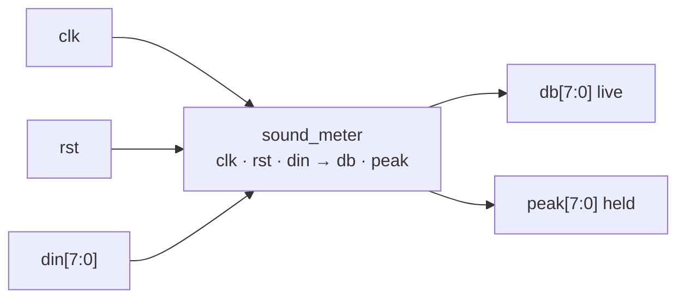
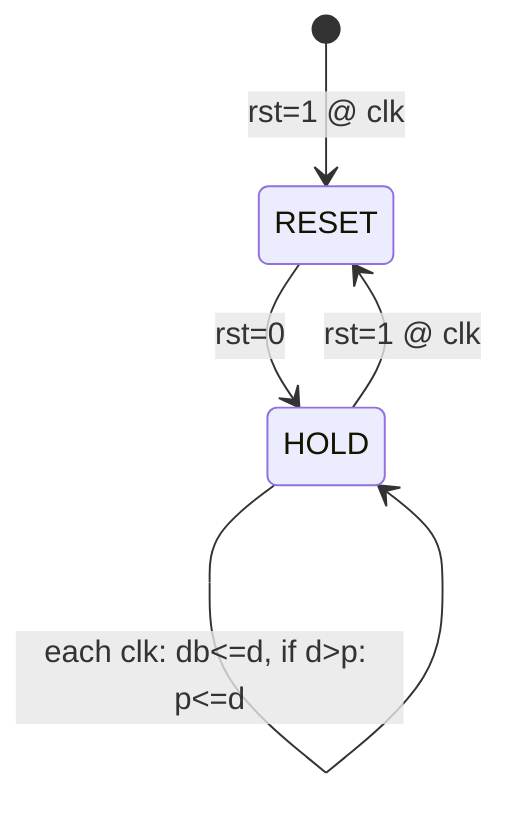
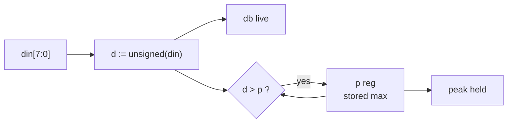

# Presentation Content — Computer Organization & Architecture (BTS30101)
<!-- Deck spec for AI PPTX generators. Keep the Empty_Template.pptx design untouched. -->

| | |
|---|---|
| **Student** | Sayantan Bharati |
| **Student Code** | BWU/BTS/25/503 |
| **Section** | B |
| **Programme** | B.Tech (CSE), Batch 2025, AY 2026-27, Odd Semester 3 |
| **Course** | Computer Organization & Architecture (BTS30101) |
| **Faculty** | Dr. Subhankar Shome |
| **Presentation Date** | 03-11-2026 |
| **Topic** | Digital Decibel Sound Level Indicator with Peak-Hold |
| **Deck size** | 12 slides = 1 Cover + 1 Introduction + 1 Index + 8 Content + 1 References & Thank-You |
| **Design** | Use `Empty_Template.pptx` theme, colours, fonts and layouts as-is (do not redesign) |
| **Visuals** | Every slide has a "Visual" block: replace it with an image/diagram. A ready inline ASCII/Mermaid diagram is given where useful. |
| **Speaker notes** | Put each "Speaker note" into the PPT notes pane (not on the slide) |
| **Style** | Minimal, digital-only, conceptual. Max ~5 bullets per slide, one idea per line. Purely focused on `sound_meter.vhd` + `tb_sound_meter.vhd`. |
| **Code fidelity rule** | Slides 5–11 describe ONLY the submitted files. Only Slide 4 mentions analog/hardware, and it is labelled "context only / NOT IN CODE". |

> **How to read this file:** `## Slide N — Title` = one PowerPoint slide. `Bullets` = text on the slide. `Visual` = the picture/diagram to add. `Speaker note` = spoken script.

---

## Slide 1 — Cover Page

**Type:** Cover  
**Title:** Digital Decibel Sound Level Indicator with Peak-Hold  
**Subtitle:** A Purely Digital Synchronous Concept in VHDL — 8-bit Model

**On-slide details (left-aligned, template title layout):**
- Course: Computer Organization & Architecture (BTS30101)
- Presented by: Sayantan Bharati | BWU/BTS/25/503 | Section B
- Programme: B.Tech (CSE), Batch 2025, AY 2026-27 (Odd Semester 3)
- Faculty: Dr. Subhankar Shome
- Department of Computer Science & Engineering, Brainware University
- Date: 03-11-2026
- Code under study: `sound_meter.vhd` + `tb_sound_meter.vhd`

**Visual:** University logo (top-right) + minimal digital hero image: FPGA / flip-flop / digital waveform abstract. Search terms: `fpga chip digital`, `digital waveform logic`.

**Speaker note:** Good morning. I am Sayantan Bharati. This is not a hardware build — it is a purely digital COA concept modelled in VHDL: an 8-bit synchronous block with a live level output and a peak-hold register.

---

## Slide 2 — Introduction

**Type:** Introduction  
**Title:** Introduction — A Small Digital Memory Idea

**Bullets:**
- Core idea: every clock, remember the **largest value seen so far**.
- Two outputs: live value `db` + held maximum `peak`.
- Fully synchronous: one `clk`, one sync `rst`, no analog in code.
- Teaches three COA basics: **register, comparator, clock discipline**.
- Demo vehicle: 8-bit codes stand in for "loudness levels".

**Visual:** Tiny concept strip: `new input → keep max → show live + max`. Search terms: `register max hold concept diagram`.

**Speaker note:** Forget microphones and circuits for now. The whole project is one digital question: how do you hold a maximum in hardware? One register plus one comparison, updated on every clock — that is the entire submission.

---

## Slide 3 — Index

**Type:** Index / Agenda  
**Title:** Presentation Outline

**Bullets:**
1. Outside the Chip — Where Sound Would Come From (context only)
2. Entity & Ports — As Coded
3. Clock, Reset & Single Process
4. Datapath Concept — Live `db` + Held `peak`
5. Verbatim VHDL Process
6. Testbench Concept — How We Verify
7. Results — Tracking, Hold, Reset
8. COA View, Limits & Future

**Visual:** Minimal 8-step roadmap / timeline. Search terms: `presentation agenda roadmap minimal icons`.

**Speaker note:** Only the first item touches the real world, and just as background. Everything after that is the code itself — ports, clocking, datapath, testbench and what the COA course learns from it.

---

## Slide 4 — Outside the Chip (The Only Non-Digital Page)

**Type:** Content (1/8)  
**Title:** Where the Signal Would Come From — Context Only

**Bullets:**
- Real meter (abstract): Mic → Preamp → ADC → digital numbers.
- **NOT IN CODE:** no mic, no amplifier, no filter, no ADC here.
- Our code starts AFTER that: `din[7:0]` = "number already inside the chip".
- From here on, everything is digital, clocked VHDL.
- Think of `din` as the boundary between physics and architecture.

**Visual:** Single faded strip with a cut line:

```
[Mic | Preamp | ADC]  - - - CUT (not coded) - - - > din[7:0] --> [THIS PROJECT: digital only]
   analog world (one box, greyed out)                    digital world (highlighted)
```

Search terms: `microphone to adc block diagram simple`.

**Speaker note:** This is the only slide about hardware, kept deliberately to one abstract box. The testbench simply plays the role of the ADC by feeding bytes like 0x10 or 0xA0. After din, there is no analog — only registers and logic.

---

## Slide 5 — Entity & Ports — As Coded

**Type:** Content (2/8)  
**Title:** The Block — Entity `sound_meter`

**Bullets:**
- `clk, rst : in STD_LOGIC` — timing + clear.
- `din : in STD_LOGIC_VECTOR(7 downto 0)` — 8-bit level in.
- `db : out STD_LOGIC_VECTOR(7 downto 0)` — live copy out.
- `peak : out STD_LOGIC_VECTOR(7 downto 0)` — held maximum out.
- Internal: one signal `p : unsigned(7 downto 0)` — the stored max.

**Visual:** Clean entity box with 5 ports (draw as native shapes):



**Speaker note:** This is the complete interface — nothing hidden. Two control lines, one byte in, two bytes out, plus one internal byte that remembers the peak. If you understand these five ports, you understand the whole design.

---

## Slide 6 — Clock, Reset & Single Process

**Type:** Content (3/8)  
**Title:** Control Concept — One Process, One Clock

**Bullets:**
- Single `process(clk)` + `if rising_edge(clk)` — nothing else controls it.
- `rst = '1'` (on a clock edge) clears `db, peak, p` to zero — synchronous.
- `rst = '0'` = track-and-hold mode: copy live, conditionally update max.
- No FSM, no divider, no extra states in code.
- COA idea: **control = when registers are allowed to change**.

**Visual:** Two-state mini diagram + clock sketch:



Plus: `clk _|‾|_|‾|_ (testbench: 10 ns / 100 MHz)`.

**Speaker note:** Control here is minimal on purpose. Reset is synchronous, so it only acts on a rising edge. Otherwise every clock does the same two things: show the input live, and keep it if it is a new maximum. That is the entire control story.

---

## Slide 7 — Datapath Concept — Live + Peak

**Type:** Content (4/8)  
**Title:** Datapath Concept — Copy + Compare + Store

**Bullets:**
- Step 1 — Convert: `d := unsigned(din)` so we can compare numerically.
- Step 2 — Live: `db <= d` — output follows input after 1 clock.
- Step 3 — Compare: `d > p ?` — is this input bigger than stored max?
- Step 4 — Store: if yes `p <= d`, else keep old `p`; `peak` shows `p`.
- So: `db` = present, `peak` = best-so-far (lags `p` by 1 cycle).

**Visual:** Native datapath diagram (theme colours):



**Speaker note:** Read left to right: the byte is copied to the live display, and simultaneously compared against the stored maximum. Only a larger value overwrites the register. That compare-and-hold is the single conceptual datapath of this project.

---

## Slide 8 — Verbatim VHDL Process

**Type:** Content (5/8)  
**Title:** The Code — Exactly As Submitted

**Bullets:**
- File: `sound_meter.vhd`, architecture `rtl`, needs `NUMERIC_STD`.
- Whole behaviour = the process below — nothing else in the file.
- Note `variable d` (immediate) vs `signal p` (holds across clocks).
- Note `peak` shows the *old* `p` — one-cycle lag is in the code.

**Visual:** Monospace code card (theme background), verbatim:

```vhdl
process(clk)
    variable d : unsigned(7 downto 0);
begin
    if rising_edge(clk) then
        if rst = '1' then
            db   <= (others => '0');
            peak <= (others => '0');
            p    <= (others => '0');
        else
            d := unsigned(din);
            db <= std_logic_vector(d);
            if d > p then
                p <= d;
            end if;
            peak <= std_logic_vector(p);
        end if;
    end if;
end process;
```

**Speaker note:** Point at each line: edge check, synchronous clear, convert, live copy, conditional max update, held output. There are no hidden entities — no ADC, RMS, log table or display driver. This process is the complete design.

---

## Slide 9 — Testbench Concept — How We Verify

**Type:** Content (6/8)  
**Title:** Verification Concept — Testbench Drives Bytes

**Bullets:**
- File: `tb_sound_meter.vhd` instantiates DUT as `uut`.
- Clock: `clk <= not clk after 5 ns` → 10 ns / ~100 MHz.
- Reset 20 ns at start, then each vector held 100 ns (~10 clocks).
- Vectors: `10 → 30 → 50 → 70 → 90 → 60 → 40 → A0 → 20 → 00 → rst → 80`.
- Design of vectors: rise, dip (hold check), new max, reset check.

**Visual:** Stimulus strip:

```
rst 20ns | 10 30 50 70 90 | 60 40 (dip) | A0 (new max) | 20 00 (hold) | rst 30ns | 80
clk: _|‾|_|‾|_ 10 ns period, each din held 100 ns
```

**Speaker note:** The testbench is the ADC substitute. It feeds a rising ramp to prove tracking, then a dip to prove the peak does not fall, then a higher value to prove the peak can advance, then a reset to prove clearing. Each step is held long enough to settle.

---

## Slide 10 — Results — Tracking, Hold, Reset

**Type:** Content (7/8)  
**Title:** What Simulation Shows

**Bullets:**
- **Tracking:** `db` = `din` (one clock later) on every step.
- **Hold:** after `90`, inputs `60/40` leave `peak = 90`.
- **New max:** `A0` moves `peak` to `A0`; `20/00` still hold `A0`.
- **Reset:** mid-run `rst` forces `00`; next `80` restarts peak at `80`.
- Waveform to show: `clk / rst / din / db / peak` with flat hold plateaus.

**Visual:** Settled-value table (verbatim behaviour) + waveform placeholder:

```
 din   db    peak   meaning
 10    10    10     rising
 30    30    30     new max
 50    50    50     new max
 70    70    70     new max
 90    90    90     max so far
 60    60    90     HOLD
 40    40    90     HOLD
 A0    A0    A0     new max (160)
 20    20    A0     HOLD
 00    00    A0     HOLD
 rst   00    00     clear
 80    80    80     restart
```

**Speaker note:** Walk three ideas only: it tracks, it holds through dips, and reset clears it. The flat peak line through 60 and 40 is the proof of hold; the jump at A0 is the proof that a larger value replaces the peak.

---

## Slide 11 — COA View, Limits & Future

**Type:** Content (8/8)  
**Title:** COA Reading + Honest Limits

**Bullets:**
- COA mapping: `p` = tiny storage, comparator = ALU bit, `clk/rst` = control.
- Synthesises to ~16 flip-flops + 8-bit compare — pure datapath + control.
- Limit (stated): levels are abstract; no dB math, no decay timer, no display.
- Future (if extended): `rms/log-LUT` before `din`, `BCD/7-seg` after `db/peak`.
- Value: clean minimal example of synchronous register discipline.

**Visual:** Three-icon row: `Storage (p)` + `Compute (>)` + `Control (clk/rst)` → `I/O (din/db/peak)`. Plus small grey "future" callout: `log-LUT, timer, display`.

**Speaker note:** Close with the COA moral: storage, a tiny piece of computation, sequencing by clock, and defined I/O — that is computer organisation in miniature. The limits are honest: this proves the hold half, not a calibrated meter; the future boxes show where a full meter would attach without changing this core.

---

## Slide 12 — References & Thank You

**Type:** References + Thank-You (single slide)  
**Title:** References & Thank You

**Bullets (References):**
- Patterson & Hennessy — *Computer Organization and Design* (5th ed.).
- Stallings — *Computer Organization and Architecture* (10th ed.).
- Hamacher — *Computer Organization* (6th ed.).
- COA lecture notes — Modules 2 & 3 (datapath, control, I/O).
- Submitted files: `sound_meter.vhd`, `tb_sound_meter.vhd` (+ IEEE 1076 / NUMERIC_STD).

**Thank-You text (bottom):**
- "Thank you for your attention — Questions are welcome."
- Sayantan Bharati | BWU/BTS/25/503 | Section B

**Visual:** Small book-cover thumbnails + "Q&A" icon. Search terms: `question and answer icon`.

**Speaker note:** These are the standard COA references plus the two submitted VHDL files. Thank you — happy to take questions on the compare-and-hold logic and the one-cycle peak lag.
