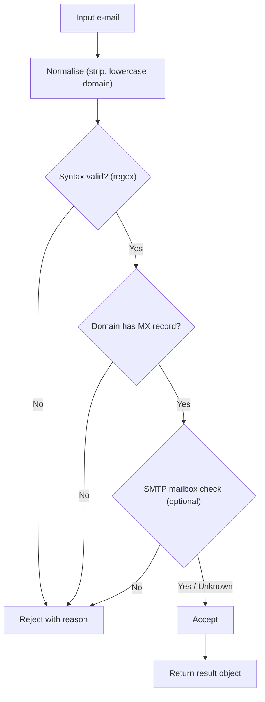

# Presentation Content — Python Programming (BES00007)
<!-- Deck spec for AI PPTX generators. Keep the Empty_Template.pptx design untouched. -->

| | |
|---|---|
| **Student** | Sayantan Bharati |
| **Student Code** | BWU/BTS/25/503 |
| **Section** | B |
| **Programme** | B.Tech (CSE), Batch 2025, AY 2026-27, Odd Semester 3 |
| **Course** | Python Programming (BES00007) |
| **Faculty** | Pranab Gharai |
| **Presentation Date** | 02-11-2026 |
| **Topic** | Email Validation System |
| **Deck size** | 14 slides = 1 Cover + 1 Introduction + 1 Index + 10 Content + 1 References & Thank-You |
| **Design** | Use `Empty_Template.pptx` theme, colours, fonts and layouts as-is (do not redesign) |
| **Visuals** | Every slide has a "Visual" block: replace it with an image/diagram. A ready inline ASCII/Mermaid diagram is given where useful. |
| **Speaker notes** | Put each "Speaker note" into the PPT notes pane (not on the slide) |
| **Style** | Light bullets, one idea per line, max ~6 bullets per slide. Show code in a monospace "code card". |

> **How to read this file:** `## Slide N — Title` = one PowerPoint slide. `Bullets` = text on the slide. `Visual` = the picture/diagram to add. `Speaker note` = spoken script. The two framing slides (Cover, References & Thank-You) carry the same branding in every deck.

---

## Slide 1 — Cover Page

**Type:** Cover  
**Title:** Email Validation System  
**Subtitle:** Checking E-mail Syntax and Deliverability using Python

**On-slide details (left-aligned, template title layout):**
- Course: Python Programming (BES00007)
- Presented by: Sayantan Bharati | BWU/BTS/25/503 | Section B
- Programme: B.Tech (CSE), Batch 2025, AY 2026-27 (Odd Semester 3)
- Faculty: Pranab Gharai
- Department of Computer Science & Engineering, Brainware University
- Date: 02-11-2026

**Visual:** University logo (top-right) + a hero image of an `@` symbol with a green check/tick. Search terms: `email validation check icon`, `email at symbol illustration`. Free sources: Wikimedia Commons (`https://commons.wikimedia.org/w/index.php?search=at+sign+email`), Pexels.

**Speaker note:** Good morning. I am Sayantan Bharati, and my topic is an Email Validation System in Python — a program that decides whether an e-mail address is correctly formed and, ideally, whether it can actually receive mail.

---

## Slide 2 — Introduction

**Type:** Introduction  
**Title:** Introduction — Why Validate E-mail Addresses?

**Bullets:**
- Every signup, contact form and mailing list collects e-mail addresses.
- A wrong address means lost communication and wasted mail-outs.
- Validation catches typos like `user@@mail.com` or `user@mail` before they are stored.
- Two levels: **syntax validation** (is it well-formed?) and **deliverability** (does the mailbox exist?).
- Python is ideal: built-in `re`, `str` methods, `smtplib`, and clean OOP.
- This project applies **strings, regex, functions, modules, exceptions and classes** together.

**Visual:** A "before/after" image: a messy form with red error crosses vs a clean address with a green tick. Inline:

```
user@@mail.com   ->  X  malformed
user@mail        ->  X  no TLD
alice@mail.com   ->  OK syntactically valid
```

Search terms: `email validation form error illustration`.

**Speaker note:** The motivation is practical — bad addresses cost us real communication. We need to check them as early as possible. This little program is also a tour of the Python syllabus: we will use string methods, regular expressions, functions, modules, error handling and classes.

---

## Slide 3 — Index

**Type:** Index / Agenda  
**Title:** Presentation Outline

**Bullets:**
1. Anatomy of a Valid E-mail Address
2. Validation Strategies Overview
3. Regex-Based Validation
4. String Methods & Manual Parsing
5. System Design & Program Flow
6. Code Walkthrough — Object-Oriented Design
7. Advanced — DNS/MX & SMTP Checks
8. Testing & Edge Cases
9. Applications & Limitations
10. Best Practices & Conclusion

**Visual:** A numbered "roadmap" graphic (horizontal timeline of the topics). Search terms: `presentation agenda roadmap icons`.

**Speaker note:** I will first define what a valid address actually looks like, then compare three ways to validate one — regex, manual string parsing, and library/DNS checks — then show the system design, walk through the code, test the edge cases, and finish with applications and limitations.

---

## Slide 4 — Anatomy of a Valid E-mail Address

**Type:** Content (1/10)  
**Title:** What Does a Valid Address Look Like?

**Bullets:**
- General form: **`local-part @ domain`**.
- `local-part`: letters, digits and `. _ % + -`; no leading/trailing dot; no two dots together.
- `domain`: dot-separated **labels**; each label starts/ends alphanumeric, may contain `-`.
- The final label is the **TLD** — at least two letters (`.com`, `.org`, `.in`).
- Length limits: local-part ≤ **64** chars, total address ≤ **254** chars.
- Governed by RFC 5321 / RFC 5322 (the Internet e-mail standards).

**Visual:** A labelled anatomy diagram of `alice.smith+news@mail.example.co.in` with each part underlined and named. Inline:

```
  alice.smith+news   @   mail.example.co.in
  |_________________|      |_____| |_______|
    local-part (<=64)       domain   TLD
```

Search terms: `email address anatomy local part domain`, `RFC 5322 email format`.

**Speaker note:** Before we can check an address, we must know its structure. Every address has a local part, an at-sign, and a domain that ends in a top-level domain. The local part has strict rules about dots, and there are length limits, all defined in the RFC standards.

---

## Slide 5 — Validation Strategies Overview

**Type:** Content (2/10)  
**Title:** Three Ways to Validate

**Bullets:**
- **1. Regex** — a pattern match; fast, no network, catches most malformed input.
- **2. Manual parsing** — `str.split`, `partition`, checks on letters/digits; explicit but verbose.
- **3. Library / DNS / SMTP** — `email_validator`, MX lookup with `dnspython`, `smtplib` handshake.
- Syntax checks are **offline**; deliverability checks need the **network**.
- Best design: **layered** — cheap syntax check first, expensive network check only if it passes.
- Trade-off: strictness vs false rejections (valid-but-unusual addresses exist).

**Visual:** A three-layer pyramid: regex/manual at the base (cheap), DNS/MX in the middle, SMTP at the top (expensive). Search terms: `email validation pipeline layers`.

**Speaker note:** There are three levels of checking, and they differ in cost. A regular expression is instant and offline. Manual parsing is more explicit but longer to write. DNS and SMTP checks are the most reliable but need a network call, so we only do them after the cheap checks pass.

---

## Slide 6 — Regex-Based Validation

**Type:** Content (3/10)  
**Title:** Practical Validation with `re`

**Bullets:**
- A **regular expression** describes the allowed character pattern.
- A good practical pattern: `^[A-Za-z0-9._%+-]+@[A-Za-z0-9.-]+\.[A-Za-z]{2,}$`.
- `^ ... $` anchor the whole string — prevents partial matches.
- `re.fullmatch()` is even safer: the whole string must match.
- Regex is compact but **not a full RFC parser** — it cannot check MX records.
- Precompile the pattern for speed when validating many addresses.

**Visual:** A code card with the pattern, plus the annotated pattern broken into `local` / `@` / `domain` / `.TLD` groups. Inline:

```python
import re
EMAIL_RE = re.compile(r"^[A-Za-z0-9._%+-]+@[A-Za-z0-9.-]+\.[A-Za-z]{2,}$")

def is_valid_syntax(email: str) -> bool:
    return bool(EMAIL_RE.fullmatch(email.strip()))
```

Search terms: `python re email regex pattern`, `regular expression cheat sheet`.

**Speaker note:** This is the heart of the syntax check. The pattern says: one or more allowed characters, an at-sign, a domain, a dot, and a TLD of at least two letters. Using fullmatch and anchoring makes sure we test the entire string, so a stray space or trailing text cannot slip through.

---

## Slide 7 — String Methods & Manual Parsing

**Type:** Content (4/10)  
**Title:** Alternative — Manual String Validation

**Bullets:**
- Sometimes clearer than regex: split and inspect each part yourself.
- Useful methods: `str.strip`, `str.count`, `str.split`, `str.partition`, `str.isalnum`, `str.startswith`.
- Steps: exactly one `@` → non-empty local-part → valid domain labels.
- Easy to give a **specific error message** per failure (better UX).
- More code, but transparent and debuggable.
- A good teaching contrast to regex.

**Visual:** A code card with a small manual validator and a decision list. Inline:

```python
def manual_check(email: str):
    email = email.strip()
    if email.count("@") != 1:
        return False, "must contain exactly one @"
    local, domain = email.split("@")
    if not local or local.startswith(".") or ".." in local:
        return False, "bad local-part"
    if "." not in domain:
        return False, "domain needs a dot"
    return True, "ok"
```

Search terms: `python string split email parse`.

**Speaker note:** Regex is not the only way. We can do exactly the same job with ordinary string methods, and the advantage is that each rule produces its own tailored error message. For a user-facing form that is very valuable. This also makes the logic easy to explain line by line.

---

## Slide 8 — System Design & Program Flow

**Type:** Content (5/10)  
**Title:** System Design & Flow

**Bullets:**
- Pipeline: **input → normalise → syntax check → domain check → deliverability → result**.
- **Normalise** first: strip whitespace, lowercase the domain.
- Reject early on cheap checks; only then do network checks.
- Wrap risky steps (network, file I/O) in **try/except**.
- Return a clear result object: `{valid, reason, suggestion}`.
- Modular = each check is one small, testable function.

**Visual:** Replace with this flowchart:



Search terms: `email validation flowchart`, `program flow diagram validation`.

**Speaker note:** The design is a pipeline. We normalise the input, run the cheap syntax test, then the domain check, then optionally the SMTP check. Each stage can reject with a reason, and network steps are wrapped in exception handling so the program never crashes on a bad connection.

---

## Slide 9 — Code Walkthrough — Object-Oriented Design

**Type:** Content (6/10)  
**Title:** Code Walkthrough — A Clean Class Design

**Bullets:**
- Encapsulate the rules in a class — cohesive and reusable.
- One method per check: `normalise`, `check_syntax`, `check_domain`, `validate`.
- `validate()` returns a `ValidationResult` (dataclass): valid flag + message.
- Uses **modules** (`re`, `dataclasses`), **functions**, **classes** and **exceptions**.
- Easy to extend (add a new check without touching the others).
- Demonstrates encapsulation from the OOP module.

**Visual:** A class diagram (`EmailValidator` with methods) plus a short code card. Inline:

```python
from dataclasses import dataclass
import re

@dataclass
class ValidationResult:
    valid: bool
    reason: str = "ok"

class EmailValidator:
    PATTERN = re.compile(r"^[A-Za-z0-9._%+-]+@[A-Za-z0-9.-]+\.[A-Za-z]{2,}$")

    def normalise(self, email: str) -> str:
        local, _, domain = email.strip().partition("@")
        return f"{local}@{domain.lower()}"

    def validate(self, email: str) -> ValidationResult:
        email = self.normalise(email)
        if not self.PATTERN.fullmatch(email):
            return ValidationResult(False, "invalid syntax")
        return ValidationResult(True)
```

Search terms: `python class uml diagram`, `python dataclass example`.

**Speaker note:** This slide shows the object-oriented version. The rules live inside one class, each check is a method, and the result is a small data object. That structure uses almost every topic we covered this semester — modules, functions, exception handling and classes — and it makes the system easy to extend.

---

## Slide 10 — Advanced — DNS/MX & SMTP Checks

**Type:** Content (7/10)  
**Title:** Advanced — Is the Mailbox Real?

**Bullets:**
- Syntax-valid does not mean the domain exists or accepts mail.
- **MX record lookup** (DNS) checks the domain can receive mail — `dnspython`.
- **SMTP handshake**: connect to the MX server and issue `RCPT TO` (often blocked/risky).
- Detect **disposable** domains and **role** addresses (`info@`, `noreply@`) with a list.
- Cache results — network checks are slow; never repeat the same lookup.
- Always honour timeouts and treat "unknown" as **not invalid**.

**Visual:** A diagram of `client → DNS MX query → mail server → RCPT TO`, with a "timeout / unknown" branch. Inline:

```
client --MX?--> DNS  --mail.example.com--> 
       --RCPT TO <alice@...>--> MX server --> 250 OK / 550 No such user
```

Search terms: `MX record lookup diagram`, `SMTP RCPT TO verification`.

**Speaker note:** The deeper level is asking the internet. An MX lookup tells us whether the domain can receive mail at all. A full SMTP check can even ask about a specific mailbox, but many servers block it, so a failure there is never proof that the address is fake — we treat uncertainty as "unknown", not "invalid".

---

## Slide 11 — Testing & Edge Cases

**Type:** Content (8/10)  
**Title:** Testing & Edge Cases

**Bullets:**
- Unit-test each rule with valid and invalid samples (`unittest` / `pytest`).
- Valid oddities: `user+tag@mail.com`, `a.b@sub.example.co.uk`, uppercase domain.
- Invalid cases: `user@@mail.com`, `user@mail`, `.user@mail.com`, `user..name@mail.com`, spaces.
- Also test empty input, very long strings, and unicode domains.
- Assert on **both** the boolean result and the **reason message**.
- Testing proves the validator is neither too strict nor too loose.

**Visual:** A two-column table of valid vs invalid addresses with expected reasons. Inline:

```
VALID                              INVALID
alice@mail.com                     user@@mail.com
user+tag@mail.com                  user@mail
a.b@sub.example.co.uk              .user@mail.com
ALICE@MAIL.COM                     user..name@mail.com
```

Search terms: `unit testing python pytest`, `email validation test cases`.

**Speaker note:** A validator is only as good as its tests. We check the obvious good and bad cases, but also the tricky ones — plus-tagging, sub-domains, uppercase — and we assert on the exact reason message, not just the yes-or-no. That is how we prove it is neither too strict nor too permissive.

---

## Slide 12 — Applications & Limitations

**Type:** Content (9/10)  
**Title:** Applications & Limitations

**Bullets:**
- **Applications:** signup/login forms, newsletters, CRM data cleaning, bulk import filters.
- Catches typos early and reduces bounced mail.
- **Limitations:** regex alone cannot confirm a mailbox exists.
- Over-strict rules reject legitimate addresses — keep the pattern reasonable.
- SMTP checks can be slow, blocked, or flagged as probing.
- Privacy: an address is personal data — handle and store it responsibly.

**Visual:** An icon row of applications (web form, newsletter, CRM, import) with a small "watch-outs" callout. Search terms: `email marketing crm icons`, `form validation`.

**Speaker note:** In practice, this system is used in signup forms, newsletters and CRM cleanup. The main caution is balance: rules that are too strict reject real people, and full mailbox checks are slow and sometimes blocked. It is also personal data, so it should be handled carefully.

---

## Slide 13 — Best Practices & Conclusion

**Type:** Content (10/10)  
**Title:** Best Practices & Conclusion

**Bullets:**
- **Layer the checks** — cheap first, network last; fail fast.
- Prefer **`re.fullmatch`** and precompiled patterns for performance.
- Give **clear error messages**; guide the user to a fix.
- **Normalise** before comparing; cache and timeout all network calls.
- Confirm by sending a **verification e-mail** — the only true test of deliverability.
- Conclusion: a small, elegant program that unites regex, strings, functions, modules, exceptions and OOP.

**Visual:** A "best practices" checklist graphic, plus a summary arrow from "input" to "verified". Search terms: `best practices checklist icon`.

**Speaker note:** To summarise: validate in layers from cheap to expensive, normalise your input, write clear messages, and remember that the only definitive way to confirm an address is to send a verification e-mail. This project is small, but it is a complete example of practical Python — and that is my conclusion.

---

## Slide 14 — References & Thank You

**Type:** References + Thank-You (single slide)  
**Title:** References & Thank You

**Bullets (References):**
- R. Nageswara Rao — *Core Python Programming*, Dreamtech Press.
- Gowrishankar S. & Veena A. — *Introduction to Python Programming*, CRC Press.
- Python Standard Library docs — `re`, `smtplib`, `dataclasses` (`https://docs.python.org/3/library/`).
- RFC 5321 / RFC 5322 — Internet Message Format and SMTP standards.
- Course lecture notes — Python modules 2, 4 & 5 (Strings, Functions/Modules, Exceptions & OOP).

**Thank-You text (bottom):**
- "Thank you for your attention — Questions are welcome."
- Sayantan Bharati | BWU/BTS/25/503 | Section B

**Visual:** Book-cover thumbnails of the reference texts plus the Python logo and a "Q&A" icon. Search terms: `python logo`, `question and answer icon`.

**Speaker note:** These are the standard references behind this presentation. Thank you for listening — I am happy to take any questions.
